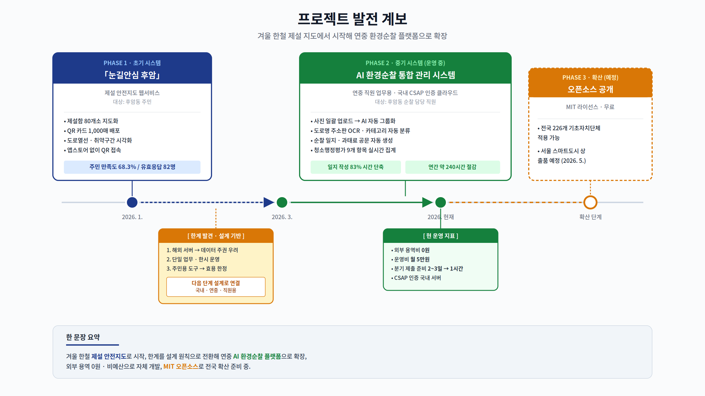
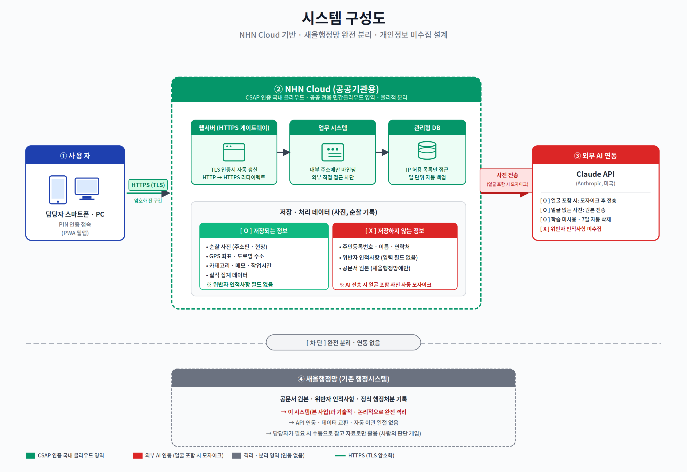
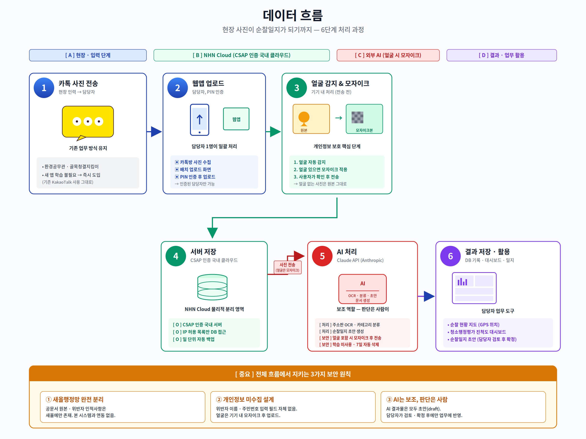

# patrol-platform

**후암동 환경순찰 통합 관리 시스템** — 사진만 올리면 AI가 주소판을 읽고, 같은 골목끼리 묶고, 순찰일지까지 써주는 웹 기반 도구.

[](./LICENSE)
[-00A3E0)](https://www.nhncloud.com/kr)
[]()
[]()

> **서비스 주소** · <https://patrol.ai.kr>
> **운영 기관** · 서울특별시 용산구 후암동 주민센터 (행정민원팀)
> **담당** · 최민국 주무관 (행정 8급) · <adqe78@yongsan.go.kr>

---

## 30초 요약

- **무엇을**: 동 단위 환경순찰 업무(사진 정리·일지 작성·실적 집계)를 AI로 자동화
- **왜**: 전국 226개 기초자치단체가 동일하게 겪는 **매일 1시간 이상의 수작업 비효율**을 해결
- **어떻게**: 현장 인력의 업무 방식(카카오톡 사진 전송)은 그대로 두고, 담당자 책상의 **뒷단 작업만 AI가 대신**
- **얼마로**: 외부 용역비 **0원** · 운영비 **월 약 5만 원** · 개발비 **0원(자체 개발)**
- **효과**: 일지 작성 시간 **1시간 → 10분 (83% 감소)**, 연간 약 **240시간 절감**
- **확산**: MIT 라이선스 오픈소스 공개 예정 → 전국 226개 기초자치단체 적용 가능

---

## 프로젝트 발전 계보

겨울 한철 제설 안전지도에서 시작해, 한계를 설계 원칙으로 전환하며 연중 환경순찰 플랫폼으로 확장된 발전 과정입니다.



| 단계 | 기간 | 범위 | 대상 | 기반 |
|---|---|---|---|---|
| **PHASE 1** | 2026. 1. ~ 3. | 제설 안전지도 | 후암동 주민 | 해외 서버 · 공개 데이터 |
| **PHASE 2** | 2026. 3. ~ 현재 | AI 환경순찰 플랫폼 | 순찰 담당 직원 | 국내 CSAP 인증 클라우드 |
| **PHASE 3** | 예정 | MIT 오픈소스 공개 | 전국 기초자치단체 | GitHub 공개 저장소 |

---

## 도입 효과

### 정량 지표 (시범 운영 기준)

| 지표 | 도입 전 | 도입 후 | 효과 |
|---|---|---|---|
| **순찰일지 작성** | 수기, 1일 **1시간** | AI 보조, 1일 **10분** | **83% 감소** |
| **실적 반영 효율** | 수작업 정리 다수 시간 | 자동 분류로 정리 시간 최소화 | 대폭 단축 |
| **분기 제출 준비** | **2~3일** | **1시간 이내** | **95% 절감** |
| **연간 시간 절감** | — | 약 **240시간** | — |
| **외부 용역비** | — | **0원** (자체 개발) | 100% 절감 |
| **운영비** | — | **월 약 5만 원** (클라우드·도메인) | — |

> *산출 근거: 일일 절감 약 1시간 × 연간 근무일 약 240일*

### 도입으로 가능해진 변화

- 담당자 코멘트 — *"그 시간에 골목을 한 번 더 돌거나 민원 처리를 할 수 있게 됐다."*
- 현장 인력 업무 방식 변경 **X** (카카오톡 전송 그대로 유지)
- 분기·반기 실적 제출을 위한 **별도 정리 작업 불필요** (자동 집계)

---

## 시스템 구성

### 시스템 구성도



- **사용자** → HTTPS(TLS) 암호화 경로로 접근
- **NHN Cloud 공공기관용**(CSAP 인증) — 웹서버 · 업무 시스템 · 관리형 DB가 물리적으로 분리된 영역에서 운영
- **Claude API** — 얼굴 포함 사진은 기기 내 모자이크 후 전송, 학습 미사용, 7일 자동 삭제
- **새올행정망** — 본 시스템과 **완전 분리 · 연동 없음** (공문서 원본·위반자 인적사항은 새올에만 존재)

### 데이터 흐름



**6단계 처리 과정** · 현장 사진이 순찰일지가 되기까지

```
1. 카톡 전송 (현장 인력, 업무 방식 유지)
2. 웹앱 업로드 (담당자, PIN 인증)
3. 얼굴 자동 감지 → 포함 시 모자이크 (기기 내 처리)
4. 국내 CSAP 인증 서버에 저장
5. AI 처리 (Claude API) · 주소판 OCR · 카테고리 분류 · 일지 초안 생성
6. 대시보드 · 순찰일지 자동 반영
```

### 보안 설계 원칙

1. **개인정보 미수집** — 위반자 인적사항 전용 입력 필드 없음
2. **기기 내 선처리** — 얼굴 감지·모자이크는 서버 전송 전 사용자 기기에서 완료
3. **행정망과 독립된 환경** — 기존 행정망과 분리된 독립 시스템에서 작동
4. **담당자 판단 개입** — AI는 초안 생성까지만, 확정은 사람이

---

## 주요 기능

### 1. 사진 일괄 업로드 → AI 자동 그룹화

하루 모은 25~50장을 한 번에 올리면, AI가 각 사진의 도로명 주소판을 읽어 같은 골목끼리 자동으로 묶어줍니다.

- 30장 동시 압축 + 청크 업로드 (10장 단위)
- Canvas API 기반 클라이언트 압축 (1280px, ~100KB/장)
- 원본 EXIF GPS 좌표 보존
- 담당자가 필요 시 그룹 병합·분할

### 2. 실시간 카메라 모드

현장에서 바로 촬영 → AI 분류 → 즉시 등록.

### 3. 순찰일지 자동 생성

날짜 범위를 지정하면 공문서 형식의 일지 초안이 자동 생성됩니다. 담당자는 초안을 참고자료로 활용하여 순찰일지 작성 시간을 대폭 줄일 수 있습니다.

### 4. 청소행정평가 진척도 대시보드

반기 평가 **9개 항목 · 22개 카테고리 · 100점 만점**을 실시간으로 자동 집계. 분기·반기 제출을 위해 따로 정리할 필요가 없습니다.

### 5. 민원 관리

민원 등록 → 담당 배정 → 처리 완료 추적.

### 6. PWA 지원

스마트폰 홈 화면에 바로가기 추가 → 앱스토어 설치 없이 앱처럼 사용.

### 7. AI 사진 자가 점검 — 담당자가 AI를 감독

AI가 주소판을 읽어 사진을 분류·기억하지만, 가끔 엉뚱한 사진이 쌓입니다. 담당자가 언제든 구역을 열어 AI가 학습한 사진을 직접 확인하고, 잘못된 사진은 삭제·교체할 수 있습니다.

- 구역 클릭 → AI가 학습한 사진들이 한 화면에 펼쳐짐
- 부정확한 사진 × 버튼 한 번에 삭제 (최근 20장 자동 유지)
- 올바른 사진 추가로 보완
- AI가 발견한 후보 구역, 승격 전에 누적 사진·이력 확인
- 모든 업무를 등록 빈도순 블록으로 한눈에 관리

> **AI에 맡기고 끝이 아니라, AI가 제안한 결과를 담당자가 언제든 검증·정정**하는 구조입니다.
>
> 상세: [`docs/AI_사진_자가점검.md`](docs/AI_사진_자가점검.md)

---

## 기술 스택

| 영역 | 기술 |
|---|---|
| **프레임워크** | Next.js 16 (App Router, TypeScript) |
| **스타일** | Tailwind CSS 4, Pretendard |
| **DB** | PostgreSQL 17 (NHN Cloud RDS) |
| **AI** | Claude Sonnet (분류 · OCR · 문서 생성) |
| **사진 처리** | Canvas API 압축 · exifr EXIF 추출 |
| **인증** | PIN + HttpOnly 쿠키 세션 |
| **배포** | NHN Cloud (CSAP 인증) · Caddy (HTTPS 자동 갱신) |
| **PWA** | 서비스 워커 · 홈 화면 바로가기 |

### 보안·컴플라이언스

- **CSAP 인증** NHN Cloud 공공기관용 영역 (물리적 영역 분리)
- **전 구간 HTTPS(TLS)** 적용, HTTP 접근 시 자동 리다이렉트
- **관리형 DB** IP 허용 목록 방식 (외부 직접 접속 불가)
- **관리자·담당자 권한 분리**
- **일 단위 자동 백업** (관리형 DB)
- **GitHub 공개 저장소** (MIT 라이선스) — 소스 투명 관리, 의존성 취약점 정기 스캔

---

## 적용 가능 규모

| 적용 대상 | 규모 | 비고 |
|---|---|---|
| 기초자치단체 (시·군·구) | **226개** | 전국 |
| 읍·면·동 주민센터 | 약 3,500개 | 기초단체 산하 |
| 환경순찰 외 적용 가능 업무 | 시설물 점검, 도로 파손 신고, 야간 안전 순찰 등 | 사진 기반 현장 업무 일반 |

---

## 문의

### 도입 검토

타 지자체·기관에서 본 시스템에 관심을 가지실 경우, 공식 창구를 통해 접수해 주시기 바랍니다.
검토 절차와 회신은 소관 부서를 통해 안내드립니다.

- **문의처**: adqe78@yongsan.go.kr (서울특별시 용산구 후암동 주민센터 행정민원팀)
- **대표 전화**: 02-2199-8410

---

## 개발자 가이드

### 로컬 실행

```bash
# PostgreSQL 시작 (Docker)
docker-compose up -d

# DB 초기화 (최초 1회)
docker exec -i patrol-platform-postgres-1 psql -U patrol -d patrol_db < prisma/init.sql
docker exec -i patrol-platform-postgres-1 psql -U patrol -d patrol_db < prisma/seed.sql

# 의존성 설치
npm install

# 개발 서버
npm run dev
```

`.env` 파일은 `.env.example`을 참고해 작성합니다. 기본 PIN은 `0000` (14명 사용자).

### 사진 처리 파이프라인

```
사진 30장 업로드 (주소판 + 현장사진 묶음)
  ↓ Canvas 압축 (1280px, ~100KB/장)
  ↓ 원본 EXIF GPS 추출
  ↓ 10장씩 청크 업로드
  ↓
AI 배치 분석 (Claude Sonnet)
  ↓ 도로명주소 표지판 OCR
  ↓ 사진 자동 그룹화 (주소판 → 현장사진)
  ↓
그룹별 리뷰 (주소 자동 입력, 수정 가능)
  ↓
일괄 제출 → DB 저장 → 순찰일지 자동 생성
```

### 버전 관리

현재 개발 버전 `0.1.0`. 보안성 검토 완료 후 `v1.0.0`으로 고정되며, 이후 `main` 브랜치는 버그 수정·보안 패치만 수용합니다.

자세한 내용은 [`docs/FREEZE_CHECKLIST.md`](docs/FREEZE_CHECKLIST.md)와 [`CHANGELOG.md`](CHANGELOG.md)를 참고하세요.

---

## 라이선스

**MIT License** · 누구나 자유롭게 사용·수정·재배포할 수 있습니다.

자세한 내용은 [`LICENSE`](./LICENSE) 참고.

---

<sub>
본 프로젝트는 서울특별시 용산구 후암동 주민센터에서 외부 용역 없이 자체 개발한 행정업무 개선 도구입니다.
담당 공무원이 퇴근 후 개인 시간과 AI 도구를 활용해 개발했으며, 공공 자산으로서 전국 기초자치단체에 무료 공개될 예정입니다.
</sub>
